# Örnek Discord Bot Projesi

Bu proje örnek bir Discord Bot projesidir. Proje içerisinde x sistemi, y sistemi ve z gibi temel özellikler bulunmaktadır. Projeyi inceleyerek kendi botunuzu geliştirebilir veya örnek olarak kullanabilirsiniz. Proje tamamen eğitim amaçlı olup, geliştiricilerin Discord bot yapımını daha iyi anlamaları için oluşturulmuştur.

<div align="center">
    <a href="https://discord.gg/opdev">
        
    </a>
</div>

## Özellikler
Proje haliyle bazı temel özellikleri içermektedir. Projenin temel özelliklerini aşağıdan inceleyebilirsiniz;
- [x] Örnek Özellik 1
- [ ] Örnek Özellik 2
- [ ] Örnek Özellik 3

## Başlangıç & Kullanım

```mermaid
graph LR
A[📲 Dışa Aktar] --> B[💾 Modülleri Yükle]
B --> C[📝 Bilgileri Doldur]
C --> D[Hazır! 🎉]
```




Projeyi ``.zip`` halinde indirdikten sonra, istediğiniz bir konuma içerisindeki dosyayı rar'dan dışarıya aktarın. Ardından projeyi kod editörünüzde açın ve proje ile ilgili modülleri projenize terminal aracılığı ile indirin.

İndirilmesi gereken modüller ve indirme: ``x, y, z`` - ``npm install x y z``

Gerekli modülleri projenize kurmanın ardından gerekli çevresel değişken dosyasını/klasörünü oluşturun ve içeriğini ekledikten sonra gerekli alanlara bilgileri ekleyin.

```dot
X_Y=
Z_K=
```
yada,
```
{
    "token": "XXXXXXXXXX.YYYYYY.ZZZZZZZZZZZZZZZZZZZZZZZZZZ.KKKKKK",
    "clientId": "xyzklmnprstuhjqtwer",
}
```

Ardından projeyi terminal üzerinden ``node .``, ``npm run start`` veya ``node app.js`` gibi komutları kullanarak başlatabilirsiniz.

## Hata Bildirimi & Destek

Projede hata bulup bize bildirmek ve proje ile ilgili destek almak için **[discord](https://discord.gg/opdev)** üzerinden yada **[instagram](https://instagram.com/openpathdevelopers)**'dan bizlere ulaşabilirsiniz.

Hatalarınızı hata yardım kanalımız ile daha detaylı ve hızlı bir şekilde çözün. Discord'a katılın > [discord.gg/opdev](https://discord.gg/opdev)
<br>
<br>
> Proje üzerindeki yükümlülükler ve sorumluluklar kullanıcı indirdikten sonra kullanıcının kendisine aittir.
<br>
<br>

Altyapı hakkında detaylı bilgilendirme ve dökümantasyon için resmi web adresimiz olan *<https://openpathdevs.com/x_projesi>* sayfasına uğrayabilirsiniz.

<div align="center">
    <sub>Proje OpenPathDevelopers Tarafından :heart: ile geliştirilmiştir.</sub>
</div>
